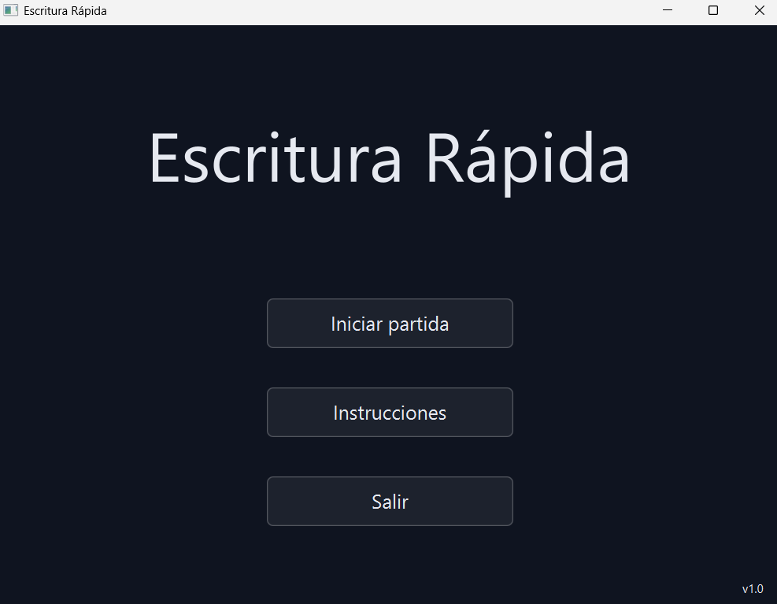
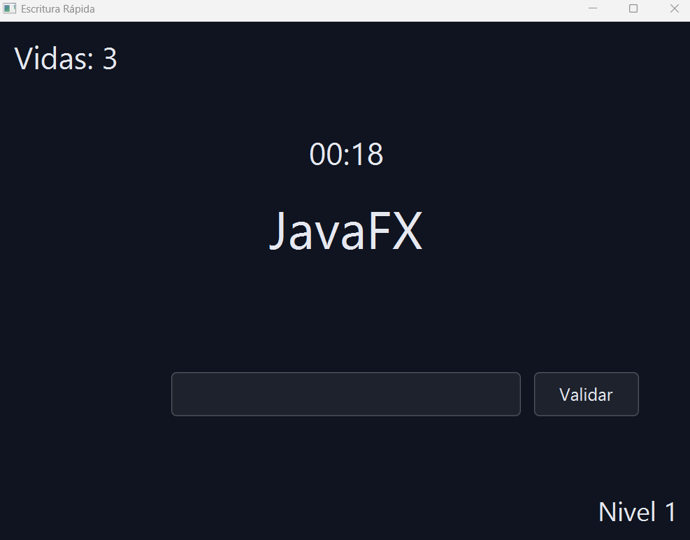
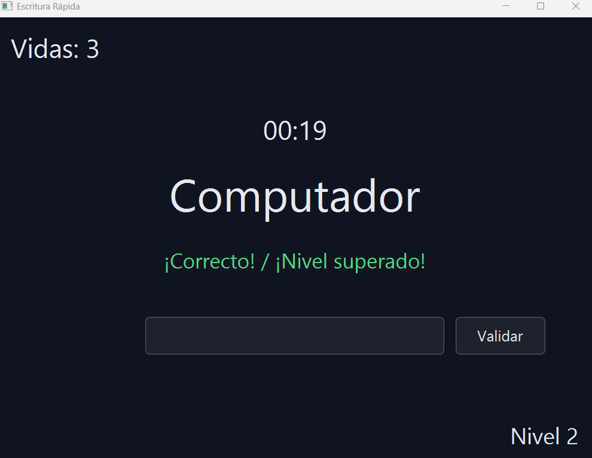
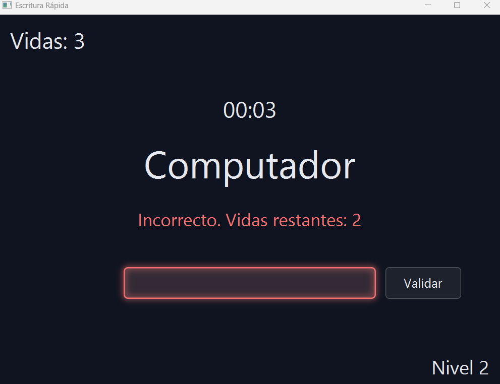
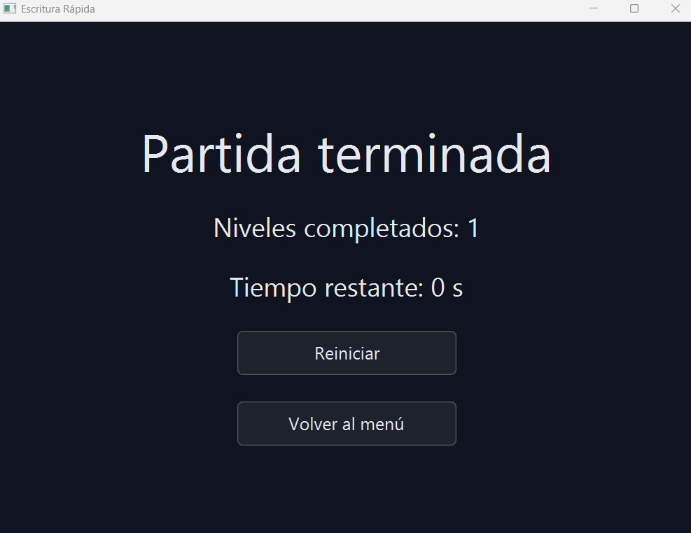
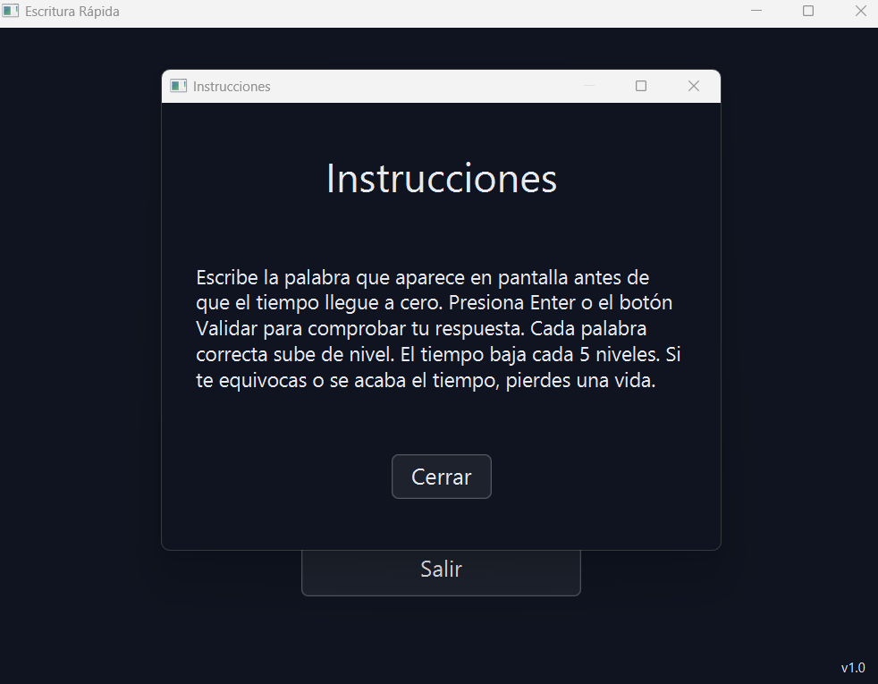

# MINI PROYECTO DE ESCRITURA RAPIDA
En este proyecto realizamos un juego en el que debes escribir las palabras que salen en la pantalla en un determinado
tiempo, si aciertas aumenta el nivel y la dificultad. En caso de fallar o que se te agote el tiempo perderas 
vidas o perderas la partida.

## Integrantes del equipo 
- Eduardo Ruales 2538441
- Juan David Silva 2535562
- Juan Sebastian Sanclemente 2535873
- FPOE Grupo #80 2026-II

## Tecnologias utilizadas
- Lenguaje: JAVA
- Libreria grafica: JavaFX
- Diseño de interfaz: Scene Builder y FXML
- Gestor de dependencias: Maven
- IDE: IntelliJ IDEA
- Javadoc

## Como ejecutar el proyecto

1. Clonar el repositorio: git clone https://github.com/eduardoruales/Mini-proyecto-escritura-rapida.git
2. Abrir la carpeta del proyecto en IntelliJ IDEA.
3. Confirmar que el SDK que se configure sea igual o superior a JDK 17
4. Ejecutar desde el panel Maven -> plugins -> javafx -> javafx:run

## Funcionalidades

- Palabra aleatoria y validación de escritura: al iniciar cada nivel se muestra una palabra que el jugador debe 
escribir exactamente igual, validando con el botón, la tecla Enter o al agotarse el tiempo.
- Temporizador por nivel: cada nivel inicia con 20 segundos, visibles en pantalla y actualizados en tiempo real.
- Progresion y dificultad: el nivel aumenta con cada acierto, y el tiempo disponible se reduce 2 segundos 
cada 5 niveles superados, hasta un mínimo de 2 segundos.
- Retroalimentacion visual: mensajes de acierto/error y resaltado de color (verde/rojo) en el campo de 
escritura, además de un resumen final con niveles completados y tiempo restante.

## Capturas de pantalla

### Menú principal

### Partida en curso

### Respuesta correcta

### Respuesta incorrecta

### Resumen de partida

### Instrucciones

## Decisiones de diseño (UX)

El diseño de la interfaz se guio por heuristicas de Nielsen:

1. Visibilidad del estado del sistema: el temporizador, el nivel y las vidas permanecen visibles al jugador
durante toda la partida, y cada intento recibe retroalimentacion inmediata ("¡Correcto!" / "Incorrecto").

2. Coincidencia entre el sistema y el mundo real: los textos usan lenguaje simple y directo 
(Validar, Iniciar partida, Vidas), evitando lenguaje tecnica o terminos de programacion inecesarios.

3. Control y libertad del usuario: el boton "Salir" en el menú y "Volver al menu" en la pantalla de resumen 
le dan al jugador una salida clara en cualquier momento, sin quedar atrapado en una pantalla que lo obligue a cerrar
de otra manera la aplicacion.

4. Consistencia y estandares: las tres pantallas comparten el mismo tema (dark theme), tipografia y estilo de 
botones, para que la navegacion se sienta igual en todas sus vistas para darle una sensacion uniforme.

5. Prevencion de errores: la comparacion de la palabra escrita es exacta caracter a caracter
(incluyendo mayusculas, espacios y puntuación), y el criterio se explica desde las instrucciones ubicadas en
el menu principal, para que el jugador sepa con anterioridad qué cuenta como error.

6. Reconocimiento en lugar de recuerdo: el temporizador está ubicado junto a la palabra que se debe 
escribir, para que el jugador no tenga que recordar el tiempo restante mientras escribe.

7. Flexibilidad y eficiencia de uso: la respuesta se puede validar tanto con la tecla Enter como con el 
botón "Validar", permitiendo que el jugador elija como dar input ya sea de una manera u otra.

8. Diseño estético y minimalista: la interfaz usa un tema oscuro con botones de estilo "glass" (semitransparentes) 
y sin elementos o animaciones innecesarias, para mantener el foco en la palabra y el tiempo.

9. Ayuda a reconocer, diagnosticar y recuperarse de errores: el campo de texto se resalta en rojo con 
el mensaje "Incorrecto" cuando la respuesta es incorrecta, y en verde cuando es correcta, indicando que la 
palabra fue correcta y no hubo error.

10. Ayuda y documentacion: se incluyo una pantalla de instrucciones accesible desde el 
menu principal, que da una explicacion breve de lo que debe hacer y lo que enfrentara el jugador una vez inicie
la partida.

## Estado del proyecto

- [x] Interfaz de las 3 pantallas principales (menú, juego, resumen) y pantalla de instrucciones
- [x] Logica del juego (niveles, dificultad, validación)
- [x] Temporizador y eventos de teclado/mouse
- [x] Estilos y tema visual
- [x] Documentación Javadoc en ingles 